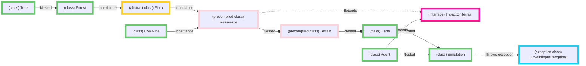

# Modelisation of climate change and its consequences🌀 🌏
#### This project is a simulation of climate change, CO2 dispersion and outside factors. 
##### Technologies Used: Java, Object oriented programming, Git
##### Functions are commented on in - 

## Description 
I aimed to modelise climate change made by C02 emmisions and how much effort it would take to reverse its consequences. 
I scaled real data - 20x20 grid represents the area od Paris and co2 quantities are proportionally to what Paris could take on. 
Two types of agents interact with Earth - good ones plant forests and close mines while the others stand for deforestation. C02 emissions are calulated based on mine activity, quality(&quantity) of forests.
Firstly, we enter a period of unsupervised mining after which two types of agents interact until the chemical balance is restored or there cannot be more forests planted. 
In the end we find out how many years it took to reverse climate changes on our grid.

## Class diagram

## Instalation and running
Download the files and unpack them.
Place yourself in a directory where you have a `src` sub-directory.
`cd src`               
`javac  -d bin  *.java`
`java -cp bin TestSimulation` 

## Credits
Project made for one of my courses I'm taking during my bachelor degree; some basic methods were provided in Serre.class and Terrain.class.

